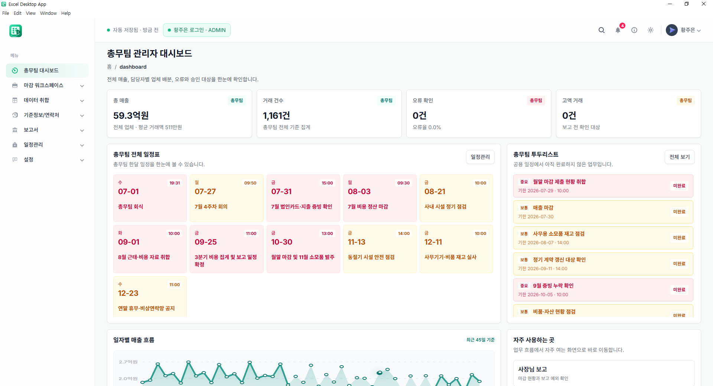
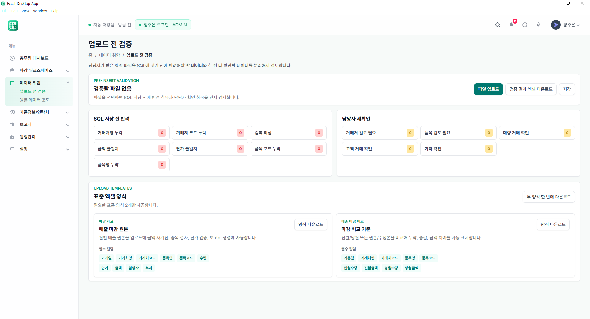
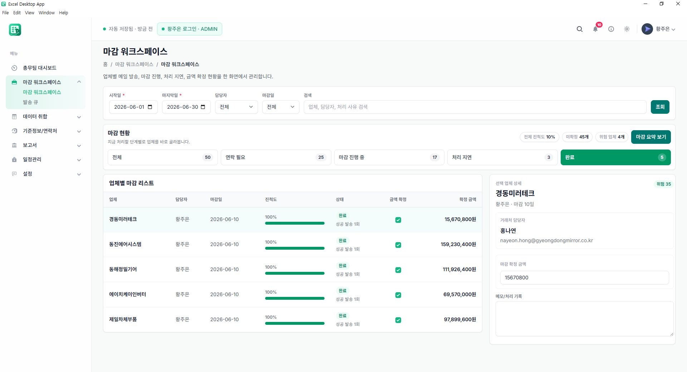

# Excel Desktop App

> **오프라인에서도 멈추지 않는 매출 마감·업무 관리 데스크톱 앱**

매출 엑셀 취합, 데이터 검증, 거래처 마감 관리, 보고서·발송 이력, 일정과 백업을 하나의 업무 흐름으로 연결한 Electron 데스크톱 애플리케이션입니다.
인터넷 연결 시 AWS와 동기화하고, 연결이 끊겨도 PC의 SQLite 데이터베이스를 기준으로 업무를 계속할 수 있도록 설계했습니다.

## 핵심 기능

| 영역 | 구현 내용 |
| --- | --- |
| AWS 인증 로그인 | AWS RDS 계정으로 최초 인증합니다. 인증에 성공한 사용자만 로컬 SQLite에 저장합니다. |
| 오프라인 우선 | 24시간 유효한 로컬 세션과 SQLite 비밀번호 해시 확인으로 인터넷이 끊겨도 업무를 이어갑니다. |
| 데이터 동기화 | 고객·상품·담당자·매출·마감·일정·검증·보고서·발송 이력을 AWS RDS와 로컬 SQLite에 동기화합니다. |
| 매출 검증 | XLSX/CSV 업로드 시 누락, 중복, 단가·금액 불일치, 기준정보 매핑 문제를 확인합니다. |
| 마감 업무 | 거래처별 마감 현황, 담당자, 미확정 사유, 요청·회신·발송 상태를 관리합니다. |
| 문서 생성 | 업체별 마감 요청 자료를 Excel·PDF로 생성하고 발송 이력을 기록합니다. |
| 파일 보관 | 필요한 엑셀·CSV·PDF만 S3에 선택 업로드하고, 검색·다운로드·삭제할 수 있습니다. |
| 백업·복구 | SQLite 로컬 데이터 백업 및 복구, PC별 저장 경로 설정을 지원합니다. |

## 시스템 구조

```text
┌──────────────────────────────┐
│        Excel Desktop App      │
│  Electron + React + SQLite   │
│   오프라인 업무 · 로컬 백업    │
└───────────────┬──────────────┘
                │ 온라인일 때 동기화
┌───────────────▼──────────────┐
│ API Gateway → Lambda (Node)  │
│ JWT 인증 · 동기화 API · 파일 API │
└───────┬───────────────┬──────┘
        │               │
┌───────▼───────┐ ┌─────▼────────┐
│ RDS PostgreSQL │ │      S3       │
│ 업무·동기화 데이터 │ │ Excel/PDF 보관 │
└───────────────┘ └──────────────┘
```

## 기술 스택

| 구분 | 기술 |
| --- | --- |
| Desktop | Electron, electron-builder |
| Frontend | React 19, React Router, Vite, Tailwind CSS |
| Local data | SQLite, better-sqlite3 |
| Excel/PDF | ExcelJS, SheetJS, PDF-Lib |
| AWS | API Gateway, Lambda, RDS PostgreSQL, S3 |
| Authentication | JWT, bcrypt |

## 주요 화면

### 대시보드

업무 현황과 핵심 지표를 한눈에 확인합니다.



### 매출 검증

엑셀 업로드부터 오류 검증, 저장까지의 흐름을 관리합니다.



### 마감 관리

업체별 마감 진행 상황과 발송 흐름을 관리합니다.



### 동기화/백업

로컬 SQLite 데이터와 AWS RDS 간 동기화 및 백업을 관리합니다.


### AWS 파일 보관함

S3 파일을 업로드, 검색, 다운로드, 삭제할 수 있습니다.


## 데이터 흐름

1. 사용자가 AWS 계정으로 로그인합니다.
2. 인증이 성공하면 사용자 프로필과 업무 데이터를 로컬 SQLite에 저장합니다.
3. 앱은 평소 로컬 SQLite를 기준으로 동작합니다.
4. 온라인 상태에서 변경 사항은 AWS RDS에 동기화됩니다.
5. 오프라인 상태에서는 로컬에만 저장하고, 연결이 복구되면 다시 동기화합니다.
6. 큰 파일은 RDS가 아닌 S3에 선택적으로 보관합니다.

## 로컬 실행

### 요구 사항

- Node.js 22 권장
- Windows 환경 권장 (Electron 설치 파일 생성 기준)
- PostgreSQL 또는 pgAdmin 설치 불필요 — 로컬 데이터베이스는 앱이 SQLite 파일로 자동 생성합니다.

```bash
npm install
npm run dev
```

브라우저 UI만 확인하려면:

```bash
npm run vite
```

빌드 확인:

```bash
npm run build
```

Windows 설치 파일 생성:

```bash
npm run dist
```

생성된 설치 파일은 `release` 폴더에서 확인할 수 있습니다.

## AWS 설정

앱 실행에 필요한 API 주소는 `.env.local`에 둡니다. 실제 주소, DB 비밀번호, JWT 비밀값, AWS 자격 증명은 저장소에 올리지 않습니다.

```bash
copy .env.example .env.local
```

```env
VITE_SHARED_API_BASE_URL=https://YOUR_API_ID.execute-api.REGION.amazonaws.com
```

Lambda 배포용 소스와 RDS 스키마는 [`aws`](aws)에 있습니다.

- [`aws/schema.sql`](aws/schema.sql): RDS PostgreSQL 테이블 정의
- [`aws/lambda/index.js`](aws/lambda/index.js): 인증·동기화·S3 API
- [`aws/lambda/build.ps1`](aws/lambda/build.ps1): Lambda ZIP 생성 스크립트

> 공개 저장소에서는 AWS 계정 번호, RDS 엔드포인트, 사용자 계정, 비밀번호, JWT Secret, S3 버킷 정책의 민감한 값을 반드시 제거하세요.

## 프로젝트 구조

```text
src/                  # React 화면·컴포넌트·서비스
public/electron/      # Electron main process와 preload IPC
public/database/      # SQLite 스키마·로컬 데이터 처리
aws/                  # Lambda API와 RDS 스키마
docs/images/          # 포트폴리오 스크린샷
```

## 구현 포인트

- 현업 매출 마감 흐름을 분석해 업로드 → 검증 → 매핑 → 마감 → 발송 → 보고로 연결
- 로컬 SQLite와 AWS RDS를 함께 사용하는 오프라인 우선 구조 설계
- AWS 인증 이후 로컬 사용자 생성 및 24시간 로컬 세션 처리
- Electron IPC로 파일 저장, SQLite 접근, PDF 생성, 다운로드 처리 분리
- S3 Presigned URL 기반의 선택적 파일 업로드·다운로드
- 오류가 발생하기 쉬운 데이터 관계를 검증 화면과 상태 중심 UI로 표현

## Contact

- GitHub: [@rlahfld54](https://github.com/rlahfld54)
- Blog: [normal-gom-jelly.tistory.com](https://normal-gom-jelly.tistory.com)
