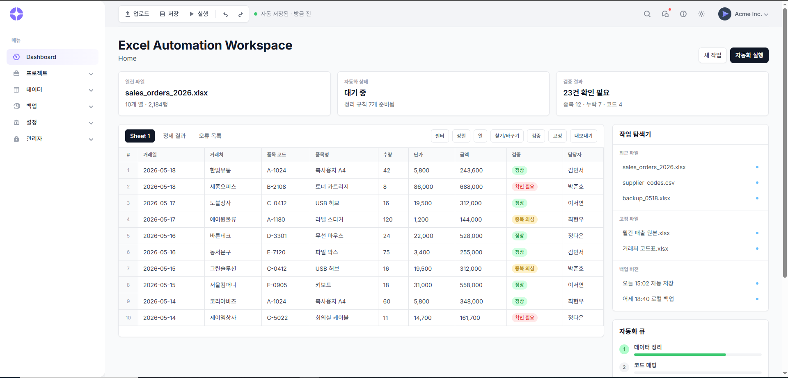

# Excel Automation Workspace

> Excel/CSV 업무 파일을 열고, 검증하고, 자동화 작업까지 한 화면에서 처리하는 데스크톱형 데이터 작업 공간입니다.

안녕하세요. 사용자에게 안정감 있는 UI와 실무에 가까운 흐름을 제공하는 풀스택 개발자를 목표로 프로젝트를 만들고 있습니다.

이 프로젝트는 단순한 관리자 대시보드가 아니라, 사무 사용자가 매일 반복하는 Excel 정리, 코드 매핑, 중복 검사, 백업, 보고서 생성 작업을 하나의 워크스페이스 안에서 자연스럽게 처리하도록 설계한 React + Electron 기반 앱입니다.

<p>
  
  
  
  
  
  
</p>



## 프로젝트 한 줄 소개

반복적인 엑셀 업무를 줄이기 위해, 파일 탐색, 스프레드시트형 데이터 검토, 자동화 실행, 로그 확인, 백업 상태를 한 화면에서 다루는 업무용 데스크톱 앱입니다.

## 왜 만들었나요?

실무에서 Excel 파일은 여전히 많이 쓰이지만, 데이터 정리 과정은 자주 흩어집니다.

- 파일을 열고
- 누락값과 중복을 찾고
- 거래처 코드나 품목 코드를 맞추고
- 결과를 저장하거나 백업하고
- 문제가 생기면 로그를 다시 확인하는 흐름

이 과정을 여러 도구 사이에서 왔다 갔다 하지 않고, 하나의 작업 공간 안에서 처리할 수 있게 만드는 것이 목표입니다.


엑셀 자동화 데스크탑 앱을 만들게 된 이유는 단순히 “업무를 편하게 하고 싶어서”가 아니었다.
실제 현업에서 반복되던 마감 업무와 검수 스트레스가 출발점이었다.

당시 총무팀에서 매출 관련 업무를 담당했는데, 가장 힘들었던 건 데이터 자체보다 “정리되지 않은 업무 흐름”이었다.
매출 마감 시즌이 되면 각 담당자와 부서에서 여러 파일이 동시에 들어왔고, 거래처·물류팀·영업팀 등 여러 곳과 계속 확인 작업을 해야 했다.

문제는 모든 사람이 같은 방식으로 일하지 않는다는 점이었다.

누군가는 날짜 형식을 다르게 입력했고,
누군가는 거래처명을 줄여 쓰거나 오타를 냈다.
단가가 맞지 않는 경우도 있었고, 중복 데이터나 누락된 데이터도 자주 발생했다.

하지만 현실적으로는:

* 업무 방식 통일 요청이 어렵고,
* 마감 시간은 정해져 있고,
* 수정 파일은 보고 직전까지 계속 도착했다.

특히 총무팀은 마지막 검수 단계였기 때문에,
앞 단계에서 발생한 오류를 빠르게 찾아내고 담당자들에게 피드백을 전달해야 했다.

현실은 항상 촉박했다.

그 과정에서 가장 큰 문제는:
“데이터를 분석하는 것”보다
“어디가 잘못됐는지 찾고, 누구에게 확인해야 하는지 정리하는 것”에 시간이 너무 많이 들어간다는 점이었다.

그래서 필요했던 건 단순한 엑셀 편집기가 아니었다.

필요했던 건:

* 데이터를 자동으로 정리하고,
* 기준 데이터와 비교해서 오류를 검출하고,
* 중복이나 단가 차이를 빠르게 찾고,
* 담당자 검수 상태를 관리하고,
* 최종 보고서까지 자동 생성해주는,
  “마감 업무 전용 작업 공간”이었다.

또한 실제 업무 환경에서는:

* 인터넷이 제한되거나,
* 보안 프로그램 때문에 외부 전송이 어렵고,
* 서버 인프라가 없는 경우도 많았다.

그래서 클라우드 중심 구조보다:
“로컬 우선(Offline First)” 구조가 더 현실적이었다.

무거운 작업은 사용자 PC에서 처리하고,
클라우드는 백업이나 설정 동기화처럼 꼭 필요한 순간에만 사용하는 방향으로 설계하게 되었다.

이 프로젝트는 단순히 자동화를 위한 도구가 아니다.

현업에서 반복되는:

* 검수 스트레스,
* 마감 압박,
* 엑셀 반복 작업,
* 부서 간 확인 과정,
* 보고 직전 수정 작업

이런 문제들을 줄이기 위해 시작된 프로젝트다.

궁극적으로는:
“사람은 최종 판단만 하고,
반복 검수와 정리 작업은 시스템이 대신 처리하는 환경”
을 만드는 것이 목표다.


## 주요 기능

| 영역 | 구현 방향 |
| --- | --- |
| Dashboard | 현재 파일, 자동화 상태, 검증 결과를 요약해서 보여주는 첫 화면 |
| Excel-like Grid | 행 번호, 시트 탭, 고정 헤더, 상태 칩을 포함한 스프레드시트형 테이블 |
| File Upload | CSV/XLSX 파일 업로드 후 첫 시트를 테이블 데이터로 표시 |
| Sample Data | 기본 화면에서 1,200건 테스트 데이터로 긴 테이블 UI 확인 |
| Automation Queue | 데이터 정리, 코드 매핑, 중복 검사, 보고서 생성 흐름 표시 |
| Workspace Explorer | 최근 파일, 고정 파일, 백업 버전을 한쪽 패널에서 확인 |
| Logs & Status | 실시간 작업 로그, 오류/경고, 선택 셀, 인코딩, 자동 저장 상태 표시 |
| Module Pages | 파일 관리, 자동화, 데이터 테이블, 백업, 설정, 관리자 메뉴 확장 |

## 화면 구성

현재 첫 화면은 업무자가 바로 사용할 수 있는 도구처럼 보이도록 구성했습니다.

- 왼쪽 사이드바: 프로젝트, 데이터, 백업, 설정, 관리자 메뉴
- 상단 툴바: 업로드, 저장, 실행, 실행 취소, 다시 실행, 자동 저장 상태
- 중앙 영역: Excel 스타일 데이터 그리드
- 오른쪽 패널: 작업 탐색기와 자동화 큐
- 하단 영역: 로그, 상태 바, 파일 메타 정보

## 기술 스택

### Frontend

- React 19
- React Router
- Tailwind CSS 4
- Chart.js
- AG Grid
- Radix UI

### Desktop & Data

- Electron
- Vite
- ExcelJS
- xlsx
- better-sqlite3
- Zustand

### 개발 포인트

- 템플릿형 카드 대시보드를 실제 업무용 워크스페이스 구조로 재설계
- 여러 메뉴가 같은 품질로 보이도록 공통 업무 화면 컴포넌트 구성
- Excel/CSV 자동화 앱에 필요한 탐색기, 큐, 로그, 상태 바 흐름 설계
- 비개발자 사무 사용자가 이해하기 쉬운 정보 구조를 우선 적용

## 폴더 구조

```text
src
├─ components        # 공통 UI 컴포넌트
├─ partials          # Header, Sidebar, dashboard sections
├─ pages             # 업무 메뉴별 페이지
├─ useComponents     # ExcelTable, Breadcrumbs 등 화면 전용 컴포넌트
├─ utils             # 테마, 전환, 유틸 함수
└─ main.jsx          # 앱 진입점
```

## 실행 방법

환경변수 예시는 `.env.example`에 정리되어 있습니다. 처음 세팅할 때 필요하면 `.env` 파일을 만들어 같은 값을 기준으로 시작하면 됩니다.

```bash
npm install
npm run dev
```

브라우저 개발 서버만 확인하려면 다음 명령을 사용할 수 있습니다.

```bash
npm run vite
```

프로덕션 빌드는 다음 명령으로 확인합니다.

```bash
npm run build
```

기본 검증 명령은 다음과 같습니다.

```bash
npm run check
```

## 브랜드 가이드

로고 컨셉, 포인트 컬러, 소개 문구, UI 사용 규칙은 [브랜드 가이드](docs/brand-guide.md)에 정리했습니다.

## 프로젝트 기준 문서

앞으로 기능을 추가할 때는 아래 문서를 기준으로 범위와 우선순위를 맞춥니다.

- [MVP 범위](docs/mvp-scope.md)
- [데이터 규칙](docs/data-rules.md)
- [화면 역할](docs/screen-map.md)
- [AI 작업 방식](docs/ai-workflow.md)

## 앞으로 구현할 것

- 실제 Excel/CSV 업로드와 테이블 데이터 연결
- 코드 매핑 규칙 관리
- 중복/누락/형식 오류 검증 로직
- 자동화 실행 상태와 로그 패널 연동
- SQLite 기반 로컬 작업 기록 저장
- 보고서 생성 및 백업/복원 흐름 고도화

## 포트폴리오에서 보여주고 싶은 점

이 프로젝트는 화려한 랜딩 페이지보다, 실제 사용자가 매일 반복하는 업무를 덜 피곤하게 만드는 도구에 가깝습니다.

저는 이 프로젝트를 통해 다음 역량을 보여주고 싶습니다.

- 사용자의 업무 흐름을 화면 구조로 바꾸는 능력
- React 컴포넌트를 재사용 가능한 업무 단위로 정리하는 능력
- 데스크톱 앱, 파일 처리, 로컬 저장소까지 고려하는 제품 설계 감각
- 작은 기능도 실제 서비스처럼 보이게 다듬는 UI 구현 능력

## Contact

<p>
  <a href="mailto:rlahfld54@naver.com">
    
  </a>
  <a href="https://normal-gom-jelly.tistory.com">
    
  </a>
  <a href="https://github.com/rlahfld54">
    
  </a>
</p>
